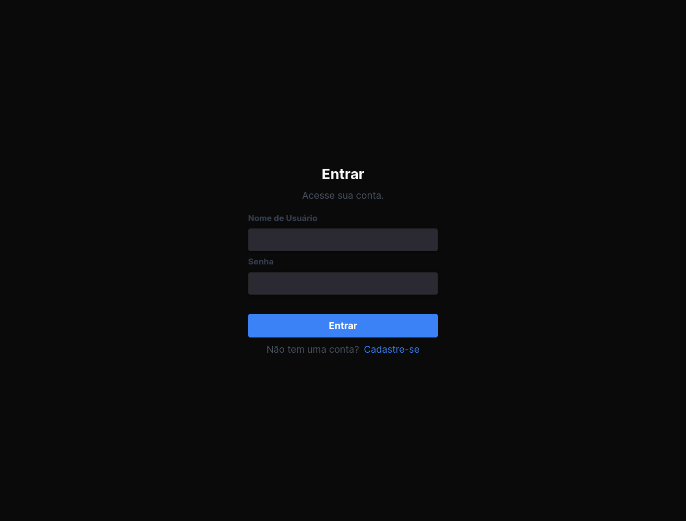
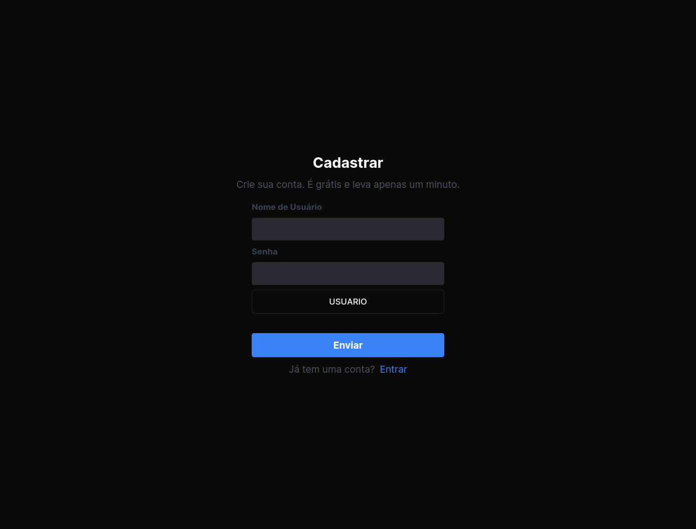
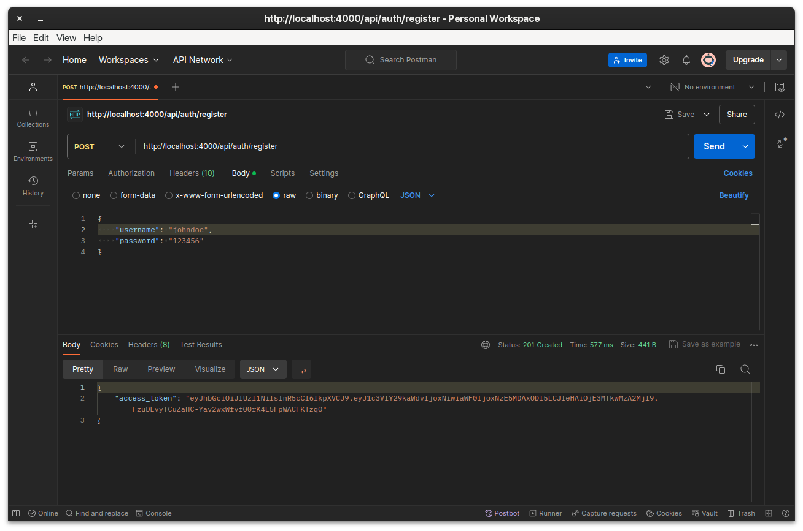

# Banco de Dados 2 - BD24S


## Grupo

| # | Nome | RA |
| - | - | - |
| 1 | Matheus Fernandes | 2523930 |
| 2 | Nycollas Augusto Wandekoken | 2523949 |
| 3 | Gustavo Bortolotto Sobreira Aquino | 2523787 |
| 4 | Marcos Vinicius do Vale Coladello dos Santos | 2508885 |
| 5 | Pedro Augusto Leite Bassan Bueno | 2523957 |

## Documentação do Trabalho

Este projeto é um monorepo que inclui uma API backend construída com Nest.js e TypeScript, utilizando PrismaORM para interação com o banco de dados PostgreSQL, e JWT para autenticação. O frontend é desenvolvido com Next.js para Server-Side Rendering (SSR).

### Requisitos

> [!IMPORTANT]
> Crie um arquivo `.env` na raiz do projeto `api` com as variáveis de ambiente necessárias.

```sh
API_PORT=4000
API_GLOBAL_PREFIX="api"

JWT_SECRET_KEY=
JWT_EXPIRATION_TIME="60m"

DATABASE_URL=

```

### Instalação

```sh
git clone https://github.com/pedrol2b/trabalho-bd2
cd trabalho-bd2
```

Instalando as dependências do `server`

```sh
yarn install
# Executa o server em modo dev
yarn start:dev
```

Instalando as dependências do `client`

```sh
# Entra na pasta do client
cd client

yarn install
# Executa o client em modo dev
yarn dev
```

### Client





### Server


